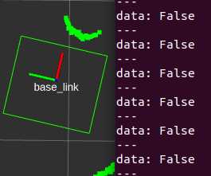
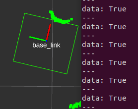

# Laser Scan Obstacle Observer Package

## Introduction

This package determines if the laserscan has any points that fall within the robot's footprint.

## Explanation

This package subscribes to a laserscan topic (`/scan`) and uses the [even-odd rule](https://en.wikipedia.org/wiki/Even%E2%80%93odd_rule) to determine if the laserscan data falls within the robot's footprint `/move_base/global_costmap/footprint`. The footprint can be inflated with the `~/padded_footprint` param.

If the laserscan points are within the robot footprint, then the `~/is_obstructed` topic would publish `true`. Else, it publishes `false`. See below for example.

 

The user might find the [`remap`](http://wiki.ros.org/roslaunch/XML/remap) function useful to remap the topics to their desire.

This package was built for [ROS Noetic](https://wiki.ros.org/noetic) on [Ubuntu 20-04](https://releases.ubuntu.com/20.04/).

## Usage

Before launching this node, please ensure that the robot is localised, and in particular, the `tf` from the `map` frame to the frame that `/scan` is published on is available. This is because the footprint published by `/move_base/global_costmap/footprint` is in `map` frame, and interally in this package, a transform is done for the footprint polygon into the frame `/scan` is in.

Start `laser_scan_obstacle_observer_node` that listens to `/scan` and `/move_base/global_costmap/footprint` with `padded_footprint=0.1`.

```shell
rosrun laser_scan_obstacle_observer laser_scan_obstacle_observer_node _padded_footprint:=0.1
```

### Topics subscribed

1. **/scan** [*sensor_msgs/LaserScan*]: Laserscan to be transformed from.
2. **/move_base/global_costmap/footprint** [*geometry_msgs/PolygonStamped*]: Footprint of the robot.

### Topics published

1. **~/is_obstructed** [*std_msgs/Bool*]: Boolean whether there's a laserscan point in the robot's footprint.
2. **~/footprint** [*geometry_msgs/PolygonStamped*]: Footprint that was used to determine if the laserscan is within the robot's footprint (i.e. padded footprint in `/scan` frame).
